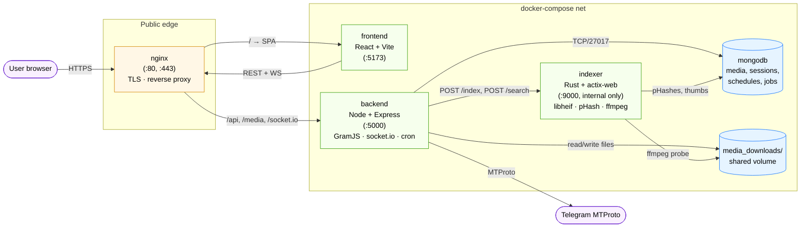
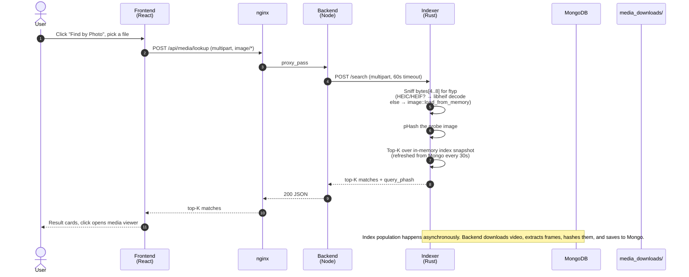

# Telegram Media Manager (TelTel)

TelTel is a full-stack Node.js application designed to manage, download, and schedule media from Telegram channels. It uses the MTProto API (via GramJS) to log in with a personal Telegram account securely.

## Features
- **MTProto Integration**: Secure OTP and 2FA login flow for personal Telegram accounts.
- **Media Downloader**: Download media content from specified Telegram channels.
- **Scheduler**: Set up cron jobs to automatically download media at specific intervals.
- **Reverse Image Search**: pHash-based "Find by Photo" — upload any image (JPEG, PNG, WebP, GIF, BMP, TIFF, **HEIC/HEIF** for iPhone photos) and locate visually-similar media already in your library. Decoding is done by the Rust indexer via libheif.
- **Admin Dashboard**: A React-based UI to view downloaded media, configure Telegram API settings, and manage scheduled tasks.
- **Containerized Architecture**: Fully Dockerized with `docker-compose` for easy deployment.

## Tech Stack
- **Frontend**: React, Vite, TailwindCSS
- **Backend**: Node.js, Express.js, GramJS
- **Database**: MongoDB
- **Indexer**: Rust, actix-web, libheif (for HEIC/HEIF decode), ffmpeg
- **Reverse proxy**: nginx
- **Containerization**: Docker & Docker Compose

## Architecture

The app runs as five containers in a single `docker-compose` stack. nginx is the only service exposed to the public internet; the others are reachable only on the internal compose network.



### Key boundaries

- **nginx** terminates TLS and splits traffic: `/` → the React SPA, `/api`, `/media`, `/socket.io` → the Node backend. Nothing else is reachable from the public internet.
- **indexer** has **no public port**. Only the backend talks to it, on `http://indexer:9000` over the compose network. This isolates the libheif C dependency surface from any untrusted input path.
- **`media_downloads/`** is a named host volume mounted into both `backend` (for upload + delivery) and `indexer` (for ffmpeg frame extraction). Mongo is the only place that holds the pHashes, frame thumbs, and job state.
- **socket.io** carries real-time progress events (indexing, forwarding, retries) from the backend to the UI; nginx passes `/socket.io/` through with WebSocket upgrade.

### Request flow: "Find by Photo"



### Core Systems

- **Telegram MTProto Client**: The Node backend connects directly to Telegram's core MTProto API using `gramjs`. It uses a full user login flow (OTP + 2FA cloud password) to authenticate as a user rather than a bot. The resulting session string is encrypted and persisted in MongoDB, allowing seamless reconnection across container restarts.
- **Background Task Scheduling**: Media fetching is automated via a robust cron-based scheduling engine running in the Node backend. Schedules and task metadata are stored in MongoDB. The engine polls targeted Telegram channels and keeps track of the last processed message IDs, ensuring that downloads resume precisely where they left off without duplicating files.
- **Rust Indexer & Media Search**: To support the "Find by Photo" reverse image search, the stack includes a dedicated, highly optimized Rust microservice. 
  - **HEIC/HEIF Support**: It leverages C bindings (`libheif`) to natively decode iPhone HEIC photos uploaded by the user.
  - **Video Frame Extraction**: It orchestrates `ffmpeg` to extract keyframes from downloaded Telegram videos inside the shared `media_downloads` volume.
  - **In-Memory Search**: It calculates Perceptual Hashes (pHash) for all media and caches the index entirely in-memory, providing microsecond-level visually similar search lookups via Hamming distance calculations.

### Container responsibilities

| Service | Port | Public? | Role |
|---|---|---|---|
| `nginx` | 80, 443 | ✅ | TLS, path-based routing, static SPA fallback |
| `frontend` | 5173 | ❌ (proxied) | Vite-built React SPA |
| `backend` | 5000 | ❌ (proxied) | REST API, socket.io, cron, Telegram client, ffmpeg orchestration |
| `indexer` | 9000 | ❌ (internal only) | pHash extraction (videos) and reverse-search lookup (images, incl. HEIC) |
| `mongodb` | 27017 | ❌ (internal only) | Persistent state — media records, sessions, schedules, pHash index |
| `media_downloads` | — | n/a | Shared host volume mounted into `backend` and `indexer` |

## Getting Started

### Prerequisites
- Docker and Docker Compose installed on your machine.
- A Telegram API ID and API Hash (obtainable from [my.telegram.org](https://my.telegram.org)).

### Installation
1. Clone this repository.
2. Start the application using Docker Compose:
   ```bash
   docker-compose up -d --build
   ```
3. Access the Admin Dashboard at `http://localhost:5173`.
4. The backend API will be running at `http://localhost:5000`.

### Configuration
1. Log in to the Admin Dashboard using the default credentials (`admin` / `admin`).
2. Navigate to the **Settings** page.
3. Enter your Telegram API credentials and phone number to initiate the OTP/2FA login flow.
4. Once authenticated, the session is securely stored in MongoDB and persists across restarts.
